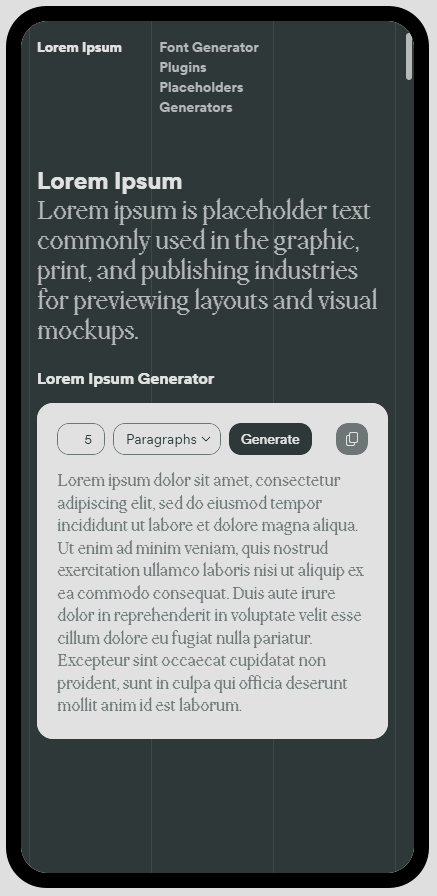
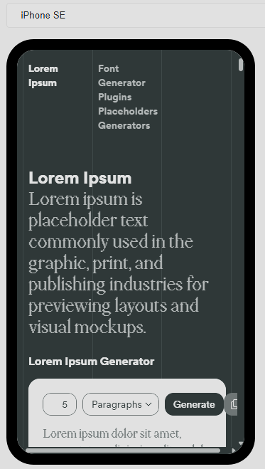
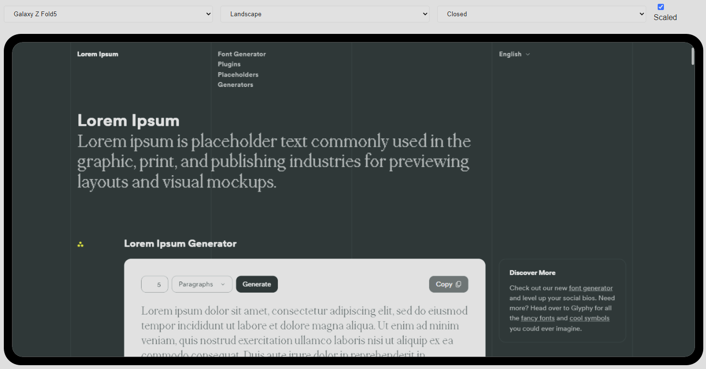

# Device Frame Web Component

A customizable web component that renders an iframe inside a mobile device frame, with options for device selection, orientation, folding, and scaling.

**[Repository](https://github.com/dustinpoissant/device-frame)** | **[Full Documentation](https://dustinpoissant.github.io/device-frame/)**

## Installation

You can install the Device Frame component via NPM or download it manually.

#### NPM Installation

Install the package using NPM:

```bash
npm install @dustinpoissant/device-frame
```

Then include the minified script in your HTML:

```html
<script type="module" src="node_modules/@dustinpoissant/device-frame/DeviceFrame.min.js"></script>
```

#### Manual Download

Download `DeviceFrame.min.js` directly from the [repository](https://github.com/dustinpoissant/device-frame) and include it in your project:

```html
<script type="module" src="DeviceFrame.min.js"></script>
```

## Attributes

| Attribute | Description | Default |
|-----------|-------------|---------|
| `src` | The URL to load in the iframe | `false` |
| `device` | Device type (e.g., iphone15promax, galaxys22ultra) | `"iphone15"` |
| `controls` | Comma-separated list of controls to show (device, orientation, fold, scaled) | `""` |
| `orientation` | Device orientation (portrait/landscape) | `"portrait"` |
| `scaled` | Scales device to fit 80% of viewport | `false` |
| `devices` | Comma-separated list of device keys to show in device picker (leave empty to show all) | `""` |

## Available Devices

- iPhone 15 Pro Max, iPhone 15 Pro, iPhone 15, iPhone SE
- Galaxy S22 Ultra, Galaxy S22+, Galaxy S22
- Galaxy Tab S9, Galaxy Tab A8
- Pixel 8, Pixel Fold, Galaxy Z Fold5, Pixel Tablet
- iPad Pro 12.9", iPad Pro 10.5", iPad Air 4, iPad 10.2"

## Basic Usage

### Simple Device Frame
```html
<device-frame src="https://example.com"></device-frame>
```



### Device Picker
```html
<device-frame src="https://example.com" controls="device"></device-frame>
```



### All Controls
```html
<device-frame src="https://example.com" controls="device,orientation,fold,scaled"></device-frame>
```



## JavaScript API

### Importing and Creating Instances

```javascript
import DeviceFrame from './DeviceFrame.js';

// Create with constructor
const frame = new DeviceFrame({
  src: 'https://example.com',
  device: 'iphone15',
  controls: 'device,orientation'
});
document.body.appendChild(frame);

// Or create with document.createElement
const frame2 = document.createElement('device-frame');
frame2.src = 'https://example.com';
frame2.device = 'iphone15';
document.body.appendChild(frame2);

// Control existing elements
const existingFrame = document.querySelector('device-frame');
existingFrame.src = 'https://new-url.com';
existingFrame.device = 'galaxys22ultra';
existingFrame.devices = 'iphone15,galaxys22ultra,ipadpro12'; // Limit options
existingFrame.orientation = 'landscape';
existingFrame.controls = 'device,orientation';
```

### Adding Custom Devices

```javascript
import DeviceFrame from './DeviceFrame.js';

DeviceFrame.devices['customphone'] = {
  name: 'Custom Phone',
  resolution: [400, 800],
  topFrameSize: 20,
  bottomFrameSize: 20,
  sideFrameSize: 15,
  innerRadius: 10,
  outerRadius: 15
};
```

### Event Handling

```javascript
const frame = document.querySelector('device-frame');

frame.addEventListener('devicechange', (event) => {
  console.log('Device changed to:', event.detail.device);
});

frame.addEventListener('orientationchange', (event) => {
  console.log('Orientation changed to:', event.detail.orientation);
});

frame.addEventListener('load', (event) => {
  console.log('Iframe loaded:', event.detail.src);
  // Access iframe for message passing
  const iframe = frame.iframe;
  iframe.contentWindow.postMessage('Hello!', '*');
});
```